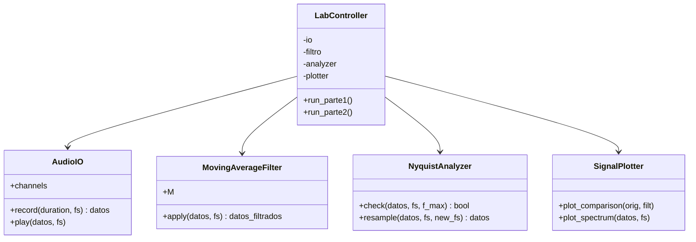
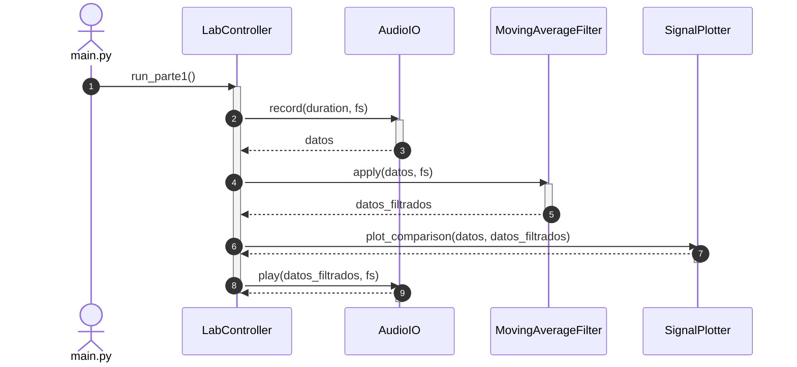
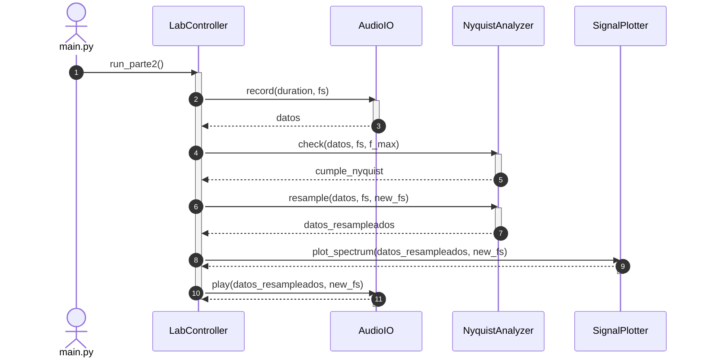

## Informe del Laboratorio

Puedes consultar el informe detallado de este laboratorio en el siguiente enlace:

📄 [Ver el Informe en Google Docs](https://docs.google.com/document/d/1uvJHZgIx_z8_txHnFeki3ycri_8WqPCX21Uvqm2-6p0/edit?usp=sharing)
## Diagrama de Clases

## Diagrama de Secuencia Parte 1: Filtrado de Promedio Móvil

##  Diagrama de secuencia Parte 2: Análisis de Nyquist y Submuestreo

